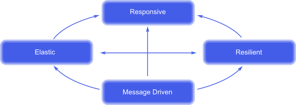

# Akka Streams 2.0 with Akka Streams 

### TL;DR

* Reactive Manifesto 2.0 - [http://www.reactivemanifesto.org/]
* Reactive Streams Specification 1.0.0 - April 30, 2015 -- [http://www.reactive-streams.org/]
* Akka Streams : 2.4.4 
* Documentation : http://doc.akka.io/docs/akka/2.4.4/scala/stream/index.html

## Reactive Manifesto Aspects

###Responsive: 
The system responds in a timely manner if at all possible.
###Resilient: 
The system stays responsive in the face of failure.
###Elastic: 
The system stays responsive under varying workload. 
###Message Driven: 
Reactive Systems rely on asynchronous message-passing to establish a boundary between components that ensures loose coupling, isolation, location transparency, and provides the means to delegate errors as messages.

[Next >> Akka Glossary](10-akka-terms.md) 
