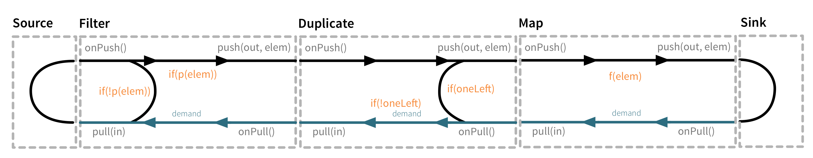
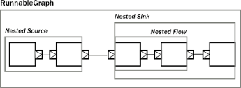

# Constructing Streams 

Linear processing pipelines can be expressed in Akka Streams using the following core abstractions:



###Source
A processing stage with exactly one output, emitting data elements whenever downstream processing stages are ready to receive them.

```scala
val source = Source(1 to 10)
val source = Source(List(1, 2, 3))
val source = Source.fromFuture(Future.successful("Hello Streams!"))
val source = Source.single("only one element")
val source = Source.empty
val source = Source.fromIterator { () => Stream.iterate(1L)(_ + 1).iterator }
```

###Sink
A processing stage with exactly one input, requesting and accepting data elements possibly slowing down the upstream producer of elements
```scala
val sink = Sink.foreach[String](println(_))
val sink = Sink.ignore
val sink = Sink.fold[Int, Int](0)(_ + _) 
```
###Flow
A processing stage which has exactly one input and output, which connects its up- and downstreams by transforming the data elements flowing through it.
```scala
val flow = Flow[Long].map(_ * 2)
val flow2 = Flow[Long].filter(_ % 2 == 0)
val flow2: Flow[Long, Long, Unit] = Flow[Long].mapAsync(2) { in => Future.successful[Long](in * 2) }
```
### Composing
It is possible to attach a **Flow** to a **Source** resulting in a composite source, and it is also possible to prepend a **Flow** to a **Sink** to get a new sink.


###RunnableGraph
A Flow that has both ends "attached" to a **Source** and **Sink** respectively, and is ready to be run().




###Illegal stream elements
In accordance to the Reactive Streams specification (Rule 2.13) Akka Streams do not allow null to be passed through the stream as an element. In case you want to model the concept of absence of a value we recommend using scala.Option or scala.util.Either.

[Next >> Graph Stages](35-graph-shapes.md) 


